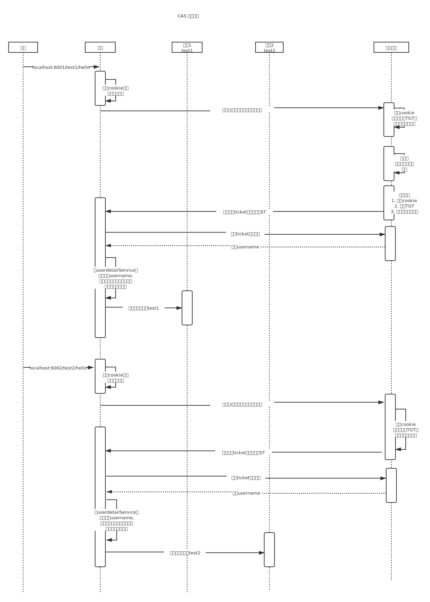

# cas-demo
基于cas 4.0。zuul + spring security cas 实现的认证demo

# CAS 单点登录Demo

## 1. 项目介绍
> 1. 1-cas-server: cas服务端项目 即：CAS认证中心 /4.0
> 2. 2-cas-register: cas注册中心
> 3. 3-cas-gateway: 使用zuul实现的网关，使用spring security 实现的权限校验
> 4. 4-cas-gateway1: 使用zuul实现的网关，使用spring security 实现的权限校验
> 4. 5-cas-test-application1: 下游测试应用1
> 5. 6-cas-test-application2: 下游测试应用2

## 2. 端口说明
> 1. cas-server: 8080
> 2. cas-register: 8761
> 3. cas-gateway: 6001
> 4. cas-gateway1: 6002
> 5. cas-test-application1: 7001
> 6. cas-test-application2: 7002

## 3. 认证中心配置
1. 修改数据库配置 `1-cas-server/cas-tomcat/webapps/cas/WEB-INF/deployerConfigContext.xml`
```xml
<bean id="dataSource" class="com.mchange.v2.c3p0.ComboPooledDataSource"
			  p:driverClass="com.mysql.jdbc.Driver"
			  p:jdbcUrl="jdbc:mysql://localhost:3306/cas_test?characterEncoding=utf8"
			  p:user="root"
			  p:password="root" />
```
2. 创建数据库
    cas_test
3. 创建表 user
```mysql
    CREATE DATABASE cas_test;
    USE cas_test;
    CREATE TABLE USER (
      `id` BIGINT(18) PRIMARY KEY AUTO_INCREMENT,
      `username` VARCHAR(32) NOT NULL DEFAULT '',
      `password` VARCHAR(32) NOT NULL DEFAULT ''
    );
    INSERT INTO USER(`username`,`password`) VALUES('admin','admin'),('yjw','yjw');
```

## 3. 项目启动顺序
> 1. 首先启动CAS 认证中心-> 通过 `0-cas-server/cas-tomcat/bin/startup.bat` 进行启动
> 2. 启动注册中心
> 3. 启动两个网关
> 4. 启动两个测试应用

## 4. 如何测试
> 通过两个不同网关，访问两个不同不服，校验单点登录
> 1. 访问服务1：`http://localhost:6001/test1/hello`
> 2. 访问服务2：`http://localhost:6002/test2/hello`
> 3. 退出服务： `http://localhost:6001/logout/cas` （注：退出后会重定向到百度首页）

## 5. 测试spring security拦截在zuul拦截之前
> 1. 首先访问服务，跳转到认证中心
> 2. 查看日志，没有任何内容
> 3. 成功登录后，跳转回原服务
> 4. 查看日志，经历了zuul的pre拦截器
> 结论：说明zuul是在security 认证之后，才进入的路由拦截器。

## 6. 认证流程

